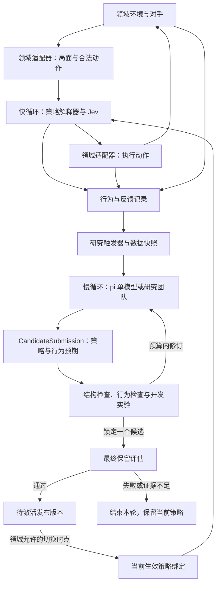

# DuelLoop：面向对抗博弈的双循环决策框架

版本：v0.3 实施基线（开发者产品目标及收敛评审补注）

日期：2026-09-22

状态：总体架构与开发者产品范围通过评审，冻结为 V1.0 实施基线。已有 0.1.0 实现；首版本地交付与真实模型受控闭环验收已完成，采用 MIT，尚未发布到 npm。这是单机开发版本；[能力范围](validation.md)区分可用接口、实验用途和生产接入职责。五项实现审查点和 R1—R10 实际证据见[实施跟踪](implementation.md)。

## 1. 产品定位与设计目标

DuelLoop 是一个面向对抗博弈的双循环决策框架：通过可配置的大模型研究团队持续复盘和迭代策略，由 Jev 在实时环境中快速做出行动决策。

**V1.0 的产品目标是：别人能够安装 DuelLoop、接入自己的环境、配置模型和策略，然后开发、运行和维护自己的对抗决策应用。** 双循环是框架提供的核心机制，公共 SDK、工具链、领域接入和运行维护共同构成开发者产品。框架正确运行与策略在某个环境中取得优势分别验收。

快循环回答“现在该怎么做”，慢循环回答“我们的决策方法应该怎样改”。两者通过可执行的策略包 `StrategyPackage` 连接。慢循环产出的新策略经实验验证后，替换后续决策实际使用的策略，使经验能够改变行动。

产品的核心交付是这条闭环：

> 观察局面 → 使用当前策略判断 → 执行动作 → 获取反馈 → 研究策略变化 → 验证 → 将新策略用于后续行动。

复盘文本、模型讨论、实验记录和版本信息用于解释及支撑策略变化。衡量系统是否成立，应检查“实际决策逻辑是否被更新、更新是否产生预期行为、是否有证据支持更新”，不能只检查是否生成了报告。

### 1.1 第一版必须具备的能力

| 能力 | 可观察的结果 |
| --- | --- |
| 持续决策 | 慢循环运行期间，Jev 继续使用当前有效策略 |
| 策略可演化 | 慢循环能修改条件、评估维度、权重、阈值和问题模板 |
| 更新能生效 | 同一局面的策略差异可以追踪到问题、评分组合及动作变化 |
| 单模型闭环 | 一个研究模型即可生成、验证和发布候选策略 |
| 可配置团队研究 | V1.0 提供单模型与团队两种模式，由使用者选择；角色可以绑定相同或不同模型 |
| 领域隔离 | 各领域提供状态、动作、反馈和评价，共用双循环机制 |
| 可安装与嵌入 | 独立项目从分发产物安装，通过公共入口托管运行或嵌入现有系统 |
| 可维护 | 可诊断、停止与恢复，支持声明范围内的备份、迁移和升级 |

### 1.2 第一版边界

V1.0 交付公开 SDK、CLI、真实 Jev/pi 集成、单模型与团队研究、策略工具链、领域模板与合规测试、SQLite 参考存储、开发者文档，以及两个不同语义的参考应用。M2 是内部闭环里程碑，完成 M3、M4 和发布验收才达到对外交付标准。SDK 和扩展契约从前期实施，不等到示例完成后才抽取。

暂不建设复杂管理后台、SaaS 多租户、插件市场或分布式集群，不同时交付扑克、麻将及交易系统，也不进行 Jev 权重训练。策略研究只能修改已定义的策略格式。领域适配器和宿主扩展是使用者信任的程序；V1.0 不承诺托管任意不可信插件。

本文推荐先用简化扑克验证闭环，再引入其他领域。股票和加密货币中的对手通常是市场参与者集合，环境也会发生变化；框架不能假定每个领域都是固定对手、双人、零和或按“局”结算。

### 1.3 使用者与开发路径

应用开发者配置现成领域并运行应用；领域开发者实现环境契约而无需修改核心循环；高级集成者通过公开扩展点嵌入已有 bot，或替换模型适配器、研究编排及存储实现。普通使用者不必先理解 pi 会话内部结构。

| 使用步骤 | DuelLoop 应提供的入口 | 使用者负责的内容 |
| --- | --- | --- |
| 安装与开始 | 可分发包、兼容说明、应用模板、无密钥离线示例 | 创建独立应用项目，选择托管或嵌入形态 |
| 接入环境 | 领域注册、模板、能力声明、合规测试 | 规则、观察视角、候选动作、反馈与评价实现 |
| 配置模型和策略 | 配置校验、模型引用、凭据引用、初始策略与协议模板 | 自己的凭据、研究角色、预算、适用策略及评价目标 |
| 开发与验证 | 策略校验和差异、夹具、实验与结构化报告 | 测试领域规则和应用行为，确定适用条件 |
| 运行与检查 | SDK 生命周期、CLI、事件、动作解释与发布状态 | 选择运行模式、观察结果、处理领域异常 |
| 维护与升级 | 停止和恢复、备份、迁移、兼容诊断、变更记录 | 管理数据保留、应用升级和运行环境 |

本节描述实施与发布要求；当前可安装包、命令及实际验收状态见[实施跟踪](implementation.md)。

## 2. 总体架构



快循环和慢循环使用独立任务队列及资源预算。第一版可部署在同一台机器，通过两个 worker 运行；不需要先拆成分布式服务。研究或实验负载不能占满实时决策的连接池和并发配额。

### 2.1 模块职责

| 模块 | 输入 | 输出与职责 |
| --- | --- | --- |
| `DomainAdapter` | 环境事件、动作指令 | 可见局面、合法候选动作、执行回执、延迟反馈、允许的切换边界 |
| `StrategyRuntime` | 局面、策略包 | 匹配条件、构造问题、组合 Jev 结果、确定动作 |
| `JevAdapter` | 状态与类型化问题 | 按类型校验结果；M0 使用 Choice / Score，Noul 为适配器扩展能力 |
| `ExperienceStore` | 决策、回执、反馈事件 | 可关联、可按截止时间冻结的研究数据 |
| `ResearchOrchestrator` | 数据快照、旧策略、研究配置 | 研究假设、候选策略、针对性场景与未解决分歧 |
| `PiAdapter` | 角色任务、上下文、工具和模型配置 | 角色产物、会话事件及实际资源消耗 |
| `Evaluator` | 候选与基线、评价协议 | 行为差异、对抗表现、资源表现和验证结论 |
| `StrategyRegistry` | 策略与验证产物 | 不可变策略版本、发布绑定、激活与回退记录 |

策略解释器负责组织判断，Jev 负责对当前局面中的明确问题作判断。领域规则能够确定的事实，如动作是否合法、下注上限及已实现收益，直接由程序计算。

第一版 `StrategyRuntime` 只接受 Score 维度并定义其组合语义。M0 的直接 Choice 路径是独立对照实现，不意味着策略语言已支持 Choice 分支；Noul 也不进入第一版策略包。适配器按类型分派校验，只有 Choice / Score 检查 `confidence`，不能要求 Noul 返回该字段。

### 2.2 公共 SDK 与依赖边界

业务应用只依赖公开 SDK 入口；核心定义领域、决策模型、研究执行与编排、存储、评价等接口，官方 Jev、pi、SQLite 和领域实现通过接口注入。核心不得直接导入 Kuhn 等私有实现；外部项目不得依赖内部源码路径。内部可以保留一个包及现有目录划分，公共导出边界、运行时 Schema 和兼容承诺必须明确。

| 使用形态 | 执行与反馈责任 |
| --- | --- |
| 托管运行 | DuelLoop 驱动观察、决策、执行、核对、反馈、研究与激活 |
| 嵌入现有应用 | 宿主提供观察并请求决策；宿主执行，或显式委托框架执行，二者只能选一个执行所有者 |

公开 API 覆盖初始化、启动、停止、单次决策、执行回执及反馈提交、研究触发与取消、状态查询和事件订阅。单次决策默认只返回决策及关联 ID，不隐式执行。宿主执行时负责状态复核和幂等提交，并回传真实回执与反馈；框架不能仅因返回了动作就记录执行成功。

SDK API、配置、策略格式、领域契约和持久数据各自版本化，所有公共输入都做运行时校验。V1.0 起公开 API 遵循 SemVer；格式兼容范围和迁移路径另列兼容表，不由包版本自动推断。机器可读错误分类至少区分配置、能力不支持、状态过期、模型超时、执行结果未知、存储失败、验证拒绝及版本不兼容，并携带相关作用域和业务 ID。事件提供事件 ID、类型和关联 ID，允许订阅方去重；不能只靠错误文本或事件到达顺序恢复状态。

公开契约使用 DuelLoop 类型，不要求领域作者操纵 pi 会话或解析 Jev 原始响应。原始响应可作为受权限约束的审计产物保留。存储替换必须保持任务领取、预算计数、幂等写入及激活比较替换的原子性，并通过相应合规测试。

## 3. 核心对象与领域接口

### 3.1 统一对象

| 对象 | 必要内容 | 设计含义 |
| --- | --- | --- |
| `Observation` | 领域及规则版本、流 ID、状态修订号、观察时间、特征、截止时间 | 表示当时真正可获得的信息，不包含未来数据或不可见对手状态 |
| `CandidateAction` | 动作 ID、类型、完整参数、适用状态修订号 | Jev 在领域提供的有限合法动作集合内判断 |
| `DecisionRecord` | 决策 ID、观察快照、候选集、策略及模型版本、问题与答案、组合结果、决策来源、降级原因与实际基线版本、最终动作 | 解释当时如何从策略走到动作，并区分基线接管 |
| `ExecutionReceipt` | 决策 ID、幂等键、环境动作 ID、执行状态、时间 | 区分选中、已提交、已接受、已完成和失败 |
| `FeedbackEvent` | 逻辑反馈 ID、修订号、被替代修订、事件时间、接收时间、关联决策或轨迹、指标、是否最终结算 | 以追加事件接收即时、延迟和修订后的结果 |
| `ResearchSnapshot` | 事件窗口、接收截止时间、精确记录及反馈修订集合、内容摘要、对手分布及结算覆盖率 | 固定一次研究实际可见的证据 |
| `StrategyPackage` | 适用范围、声明式决策逻辑、问题模板、来源 | 慢循环提交给快循环的核心产物 |
| `CandidateSubmission` | 完整策略、基线发布摘要、快照、假设、证据、行为断言与回归场景 | 一次正式、不可变的研究提交，详见 6.5 节 |
| `ResearchRun` | 基线发布摘要、研究快照、评价协议摘要、会话配置、预算与任务状态 | 创建时确定本轮目标及终止规则 |
| `EvaluationProtocol` | 数据划分、指标与门槛、样本量、知识状态模式、对手初始化及评估预算 | 独立于候选定义何为改进 |
| `ValidationReport` | 被测产物摘要、基线、评价协议、结果、结论 | 由实验服务生成，不由研究模型自行宣告通过 |
| `ReleaseBinding` | 策略摘要、验证报告、兼容运行时和模型、目标作用域、激活规则 | 指定哪个策略可以在何处、何时运行 |

版本与验证共同构成可发布策略的完整交付，但验证报告独立存储，并引用策略内容摘要。这样可避免把报告写回策略包造成内容摘要变化及循环引用。

### 3.2 领域适配器契约

以下是 DuelLoop 的概念接口，不是第三方 SDK 的现有 API：

```typescript
interface DomainAdapter {
  observe(streamId: string): Promise<Observation>;
  candidates(observation: Observation): Promise<CandidateAction[]>;
  execute(command: ActionCommand): Promise<ExecutionReceipt>;
  executionStatus(idempotencyKey: string): Promise<ExecutionReceipt>;
  feedback(cursor?: string): AsyncIterable<FeedbackEvent>;
  activationBoundary(streamId: string): Promise<ActivationBoundary>;
  fallback(observation: Observation, reason: string): Promise<FallbackResult>;
}
```

`ActionCommand` 必须携带 `decisionId`、`idempotencyKey`、`expectedStateRevision`、动作及截止时间。适配器应在提交时检查状态修订号与动作合法性。`FallbackResult` 要么提供当前合法的保底动作，要么明确表示等待或中止；等待仅在领域规则允许时有效。

领域适配器同时提供版本化的特征契约和决策上下文。特征契约声明各字段的类型、单位、必填性与缺失值表示；决策上下文包含规则摘要、行动者视角、动作含义和收益定义。规则摘要必须足以区分领域变体，例如 Kuhn 的三张牌、单轮固定下注和不可加注，不能仅向 Jev 提供一个规则版本号。

模拟与评估使用独立的 `EvaluationAdapter`，提供场景重置、对手配置、随机种子和指标计算。实盘执行适配器不必为了实现接口而伪造模拟能力。

### 3.3 可注册领域与能力声明

领域以 `DomainDefinition` 注册，包含领域/规则版本、观察和特征 Schema、动作契约、决策上下文、基线、适配器工厂、切换边界及可用评价能力。初始策略、示例配置和测试夹具随模板提供。领域包可直接位于用户应用中，不要求独立服务或公开发布到包仓库。

前述 `DomainAdapter` 是托管形态的概念接口。公共契约按能力拆分观察、执行/核对、反馈及评价部分；嵌入形态由宿主承担对应能力。不支持查询的领域不必伪造 `executionStatus`，启动检查根据执行模式要求必要能力。

| 能力声明 | 对应功能约束 |
| --- | --- |
| 提交去重、执行状态查询或显式核对 | 决定未知回执如何恢复；缺少时不得盲目重试或承诺恰好一次 |
| 延迟/修订反馈、反馈关联层级 | 决定结算窗口及快照处理，未结算不作为零收益 |
| 策略切换边界 | 决定何时激活及为什么延期 |
| 模拟、独立离线评价或受控在线评价 | 决定可运行的实验；无充分独立评价路径可决策和研究，但候选不具备自动发布资格 |

观察和关联记录包含 `applicationId`、`domainId`、`strategyScopeId`、`streamId`、`actorId` 及可见性约束。规则引擎掌握的隐藏状态不进入行动者输入；不同应用、作用域及行动者的状态和产物不能串用。第一版只承诺有限合法候选集合，金额或数量等参数由领域完整生成，不宣称支持任意连续动作空间。

可安装的合规测试套件供外部项目运行，覆盖合法性、过期状态、无动作/强制动作、重复提交、未知回执、延迟与修订反馈、激活边界、知识隔离和场景重置。可选能力未声明时报告跳过及因此禁用的功能，不把跳过记为能力验证成功。测试失败应定位契约、输入夹具及原因。

### 3.4 不强制以“一局”为单位

框架采用三个独立概念：

- **决策点**：一次观察和动作选择。
- **轨迹**：相互关联的一段行动过程，可以是一手牌、一次交互或一段持仓过程。
- **评价窗口**：用于统计和研究的数据区间，可以按轨迹数、时间或事件划分。

延迟反馈通过 ID 关联到决策或轨迹。未结算记录保留为未结算，不将其收益填成零。无法准确归因到单步的结果保留在轨迹层，避免把同一终局收益重复算到每个动作上。

`eventTime` 表示领域事件发生时间，`receivedAt` 表示框架接收时间，修订使用稳定的 `feedbackId` 和递增 `revision`。冻结快照先按事件窗口取样，再对每个反馈选择 `receivedAt <= cutoff` 的最高有效修订，并保存精确 `(feedbackId, revision)` 清单及摘要。重复或乱序到达不能覆盖更高修订，冲突修订需标记异常。截止时间后收到的修正只进入新快照；即使事件时间在旧窗口内，也不修改旧证据。若修正使旧结论失去依据，应追加失效标记和重新评估任务，保留原报告及所用数据。

## 4. StrategyPackage：可执行的策略表达

### 4.1 设计选择

第一版采用受约束的声明式策略语言，由确定性解释器执行。JSON 是规范存储格式，YAML 可作为编辑格式并转换为 JSON。策略不包含任意 JavaScript、Python、网络请求或文件操作。

慢循环可以调整真实的决策结构：增加或删除评估维度、修改问题与评分标准、组合已有特征形成新条件、改变各条件下的动作权重与选择方式。它不能增加领域尚未实现的特征、发明非法动作或修改实验通过标准。

| 部分 | 关键字段 | 约束 |
| --- | --- | --- |
| 身份 | `schemaVersion`、`strategyId`、`version`、`parentVersion` | 每个版本不可变；分支版本不靠编号大小决定是否替换 |
| 适用范围 | `scope`、规则与特征契约版本 | 不匹配时使用兼容基线 |
| 输入组织 | `stateProjection` | 只引用领域注册且决策时可见的特征 |
| 判断模板 | `questions`、`semantics` | 明确目标、评价范围、后续假设、维度关系、事实依据、评分等级及归一化方式 |
| 逻辑 | `decision` | 条件、维度组合、权重、选择器及平分处理 |
| 退出与降级 | `exitConditions`、`fallback` | 不适用或证据不足时有明确路径 |
| 来源 | `provenance` | 数据快照、研究任务、假设及修改原因 |

运行时硬限制单独配置，包括决策截止时间、最大问题数、领域动作约束和执行资源上限。候选策略不能通过修改自身字段放宽这些限制。

### 4.2 策略示例

以下 JSON 是提议的 DuelLoop 策略格式，不是 Jev 请求体，也不代表已经实现的 JSON Schema。示例用于简化扑克：持低牌且面对高跟注率对手时，增加对暴露风险的重视。参数仅用于展示机制，需经实验确定。

每个维度的 `semantics` 与等级描述一起参与内容摘要，并由请求构造器传给 Jev。它们是评分契约，不是仅供阅读的注释：

| 语义 | 本例约定 |
| --- | --- |
| 评价范围 | 执行当前候选后，直到本手牌结束；不包含未来牌局 |
| 后续行为 | 己方按固定、版本化的 `continuationPolicyDigest` 继续；对手行为依据当前可见历史与有样本量的统计判断 |
| `gain` 目标 | 本手终局净筹码收益的方向与强弱，基准为支付底注前的筹码，已包含可能损失 |
| `exposure` 目标 | 从当前决策起新增投入筹码最终损失的可能性；不重复计入已经支付的底注 |
| 维度关系 | `gain` 已含损失，额外扣减 `exposure` 是明确的风险偏好惩罚，不宣称两个维度独立 |
| 事实依据 | 私牌、公开行动、已投入筹码、合法动作与已观测对手统计；不使用对手隐藏牌或未来行动 |

第一版采用双方共享的固定参考续打策略，避免要求 Jev 递归预测尚未执行的整套候选策略。它是局部评分的参照，不会接管正常执行；真实对抗实验仍让候选及旧策略各自完成整条轨迹。参考策略的版本及有界行为描述写入发布绑定和公共决策上下文；仅提供摘要字符串不够。更换续打假设属于评分语义变化，需要重新验证。

领域直接计算合法性、底注、当前投入和各终局的收益公式；有可信精确计算器时，对应数值作为事实输入，不让 Jev 再猜。这里的 Score 表示不完全信息下的有序判断，不充当精确期望收益计算器。

```json
{
  "schemaVersion": "1.0",
  "strategyId": "kuhn-adaptive",
  "version": "v2",
  "parentVersion": "v1",
  "scope": {
    "domain": "kuhn-poker",
    "rulesVersion": "1",
    "featureContract": "kuhn-features-v1"
  },
  "stateProjection": [
    "self.card",
    "self.committedChips",
    "round.history",
    "round.pot",
    "opponent.observedCallRate",
    "opponent.callOpportunities"
  ],
  "questions": [
    {
      "id": "gain",
      "type": "score",
      "forEach": "candidate",
      "semantics": {
        "target": "terminal_net_chip_return",
        "horizon": "trajectory_end",
        "continuation": "release.continuationPolicyDigest",
        "overlap": "includes_losses; exposure adds intentional risk aversion"
      },
      "instructions": "依据公共规则、候选 {{candidate.id}} 和参考续打策略，评价本手终局净筹码收益的方向。以支付底注前为基准，包含损失；未知对手牌不得当作已知。",
      "criteria": [
        "公开行动与牌力支持净损失，且可能损失底注以外的筹码",
        "净损失迹象占优，但主要损失接近已支付底注",
        "可见证据支持收益与损失大致抵消；单纯缺信息不等于此等级",
        "净收益迹象占优，但主要机会是赢得对手底注",
        "净收益迹象占优，且有牌力与行动证据支持赢得对手额外投入"
      ],
      "normalization": "divide_by_max_level"
    },
    {
      "id": "exposure",
      "type": "score",
      "forEach": "candidate",
      "semantics": {
        "target": "loss_of_newly_committed_chips",
        "horizon": "trajectory_end",
        "continuation": "release.continuationPolicyDigest",
        "overlap": "intentional downside penalty in addition to gain"
      },
      "instructions": "评价执行 {{candidate.id}} 并按参考策略续打后，从现在起新增投入的筹码最终损失的可能性。不把底注当作新增暴露，结合牌力、公开行动与有样本量的对手记录判断。",
      "criteria": [
        "候选与参考续打不再投入筹码，或规则已保证新增筹码不会损失",
        "会新增投入，但当前牌力和对手行动主要支持保住这部分筹码",
        "会新增投入，支持保住与损失这部分筹码的证据接近；单纯缺信息不等于此等级",
        "会新增投入，较弱牌力或对手持续参与的记录主要支持这部分筹码损失",
        "会新增投入，规则或充分的公开证据使这部分筹码损失几乎不可避免"
      ],
      "normalization": "divide_by_max_level"
    }
  ],
  "decision": {
    "defaultWeights": { "gain": 1.0, "exposure": -0.2 },
    "branches": [
      {
        "id": "weak-hand-vs-frequent-caller",
        "when": {
          "all": [
            { "feature": "self.card", "op": "eq", "value": "J" },
            { "feature": "opponent.callOpportunities", "op": "gte", "value": 40 },
            { "feature": "opponent.observedCallRate", "op": "gte", "value": 0.65 }
          ]
        },
        "weights": { "gain": 1.0, "exposure": -0.7 }
      }
    ],
    "branchPolicy": "first_match",
    "aggregate": "weighted_sum",
    "selection": { "mode": "argmax", "tieBreak": "domain_priority" },
    "minRequiredConfidence": 0.55
  },
  "exitConditions": [
    { "feature": "observation.isStale", "op": "eq", "value": true }
  ],
  "fallback": { "mode": "domain_baseline" },
  "provenance": {
    "researchRunId": "research-example-002",
    "snapshotId": "snapshot-example-001",
    "hypothesis": "持低牌时减少对高跟注率对手的低质量下注"
  }
}
```

领域决策上下文、`candidates` 和观察新鲜度等运行时元数据由框架附加到投影后的状态；每个候选包含完整参数。上下文摘要随规则版本固定并记录内容摘要，策略投影不能将其删除。每个问题展开为唯一 ID，例如 `gain:bet`，且问题文本明确指向对应候选。同批问题共享相同状态。

分支按数组顺序首次匹配，未匹配使用默认权重。分支权重为完整替换，必须覆盖当前所有评分维度。权重可为负数，得分较大是否更优由权重方向定义。

第一版条件运算符限定为 `eq`、`gt`、`gte`、`lt`、`lte`、`in` 和 `all/any/not`。特征缺失或未知产生三值逻辑中的 `unknown`，`not unknown` 仍为 `unknown`；只有条件结果为 `true` 才进入分支。输入投影中由领域特征契约声明为必填的特征缺失时触发降级，策略不能放宽必填约束。

本例契约将 `opponent.callOpportunities` 声明为必填非负整数，将 `opponent.observedCallRate` 声明为可选数值。冷启动时两者分别为 `0` 和 `null`，分支不命中，使用默认权重；不会仅因缺少跟注率而降级。公共问题指令要求 Jev 将 `null` 解释为未知，基于当前牌局和规则评分，不虚构对手特征；若因此产生低置信度，再按统一阈值降级。已有统计但样本不足时同样不命中本例分支。

### 4.3 从策略到动作

对每个候选动作 `a`，将 Score 结果归一化：

```text
normalized_score(a, k) = raw_score(a, k) / (levels(k) - 1)
utility(a) = Σ weight(k, matched_branch) × normalized_score(a, k)
action = select(utility, selection_config)
```

每个 Score 使用 2—10 个有序等级，提交时检查此约束。解释器检查答案完整性、数值范围及必需问题的置信度，再执行组合。第一版所有评分维度均为必需；任一候选的必需问题低于阈值就对整次决策降级，不能把缺失或不确定评分当作零分。`0.55` 仅为本例数值，不是框架默认阈值，需依据领域数据和行为后果校准。

`utility` 是策略内部的相对偏好分，不是实际筹码收益或经过校准的胜率。收益和胜率由领域实验测量。Jev 的置信度反映答案概率分布的集中程度，也不能当作动作成功率。

组合器可以在后续提供经注册的其他算子；第一版优先实现加权和及有序条件，避免设计通用编程语言。

### 4.4 混合策略与可预测性

对抗环境可能需要随机化行动。V1.0 实现 `argmax` 和 `softmax_sample` 两种模式；不能仅接受配置而不执行。后者使用有限且大于零、位于运行时公开支持范围内的温度，按 `exp((utility - maxUtility) / temperature)` 归一化抽样，记录完整动作分布、实际动作概率及随机源标识。分数必须有限，归一化失败不能静默改成 `argmax`，应记录数值错误并走已定义降级。相同最高分在 `argmax` 下按领域固定优先级处理，softmax 中同分动作同概率。测试使用固定种子；实际运行使用独立、不可被对手预知的随机源。

Jev Choice 返回的概率表示模型对选择的判断，不能自动等同于博弈中的最优混合策略。是否随机化、怎样形成分布，以及这种分布能否抵抗利用，都属于策略与实验的职责。

策略工具链还需限制条件深度、分支数、维度数、展开问题数和上下文规模。超限提交返回明确错误，不能悄悄截断策略；规范化、摘要与编译必须稳定且可测试。新增确定性能力通过可信、版本化的领域特征或注册算子提供，研究模型只能引用允许范围内的能力。

## 5. 快循环：实时决策路径

### 5.1 一次决策的顺序

1. **获取可见状态**：读取状态修订号、合法候选动作及领域截止时间。
2. **固定策略快照**：获取当前轨迹绑定的 `ReleaseBinding`，本次决策不再切换版本。
3. **检查适用性**：核对规则、特征契约、退出条件与资源限制；不满足则走领域基线。
4. **组织 Jev 问题**：投影状态，展开候选及维度，匹配条件并生成类型化问题。
5. **调用与校验**：在剩余时间内请求 Jev，校验答案 ID、类型、数值、置信度及模型信息。
6. **组合判断**：根据当前策略计算偏好并选择动作，记录匹配分支与随机化信息。
7. **提交前复核**：检查状态仍可执行，以幂等键提交；状态已变化则在时间允许时重新观察和决策。
8. **记录与追踪反馈**：保存决策、回执及耗时，后续反馈异步追加并关联。

只有一个合法动作时可直接选定并记录 `forced_action`，不必调用 Jev。所有动作来源统一经过执行模式、唯一所有者、新鲜度及持久意图检查；强制动作只跳过模型，不跳过提交检查。`shadow` 和仅返回决策的嵌入路径都不调用真实执行接口，降级基线也不能自行补执行。没有合法动作时由适配器判断是等待、终局还是异常。

`DecisionRecord.decisionSource` 按最终决定动作的路径取值：`strategy`、`domain_baseline`、`forced_action` 或 `abstain`。其中 `abstain` 表示领域允许的等待或中止，最终动作可以为空。降级记录同时保存原 `strategyDigest`、原因、实际 `fallbackBaselineDigest`、最终动作以及已有的模型答案；没有调用 Jev 时显式记录未调用。不能把领域基线接管后的动作归入 Jev 主动选择。

### 5.2 Jev 的调用方式

优先把相互独立的问题合并成一次请求。例如三个动作、两个维度产生六个问题。它们独立地针对同一状态求值，不会互相读取同批答案。

第一版条件只依赖已知状态，避免形成复杂的模型调用链。需要先识别对手类型再提问时，可将各类型的独立问题一次发出、在代码中选择相关结果；问题过多时才考虑有明确依赖的两阶段请求。两阶段必须共享整个决策的截止时间，不能分别重置预算。

问题数量和状态长度仍受资源上限约束。官方关于并行求值的描述不构成固定延迟承诺，应实测不同候选数、状态长度及网络条件下的 p50 / p95 / p99 延迟。

### 5.3 截止时间与故障处理

```text
可用模型时间 = 领域截止时间 - 当前时间 - 预留执行时间
```

超时、限流、答案缺失、低置信度或不支持的策略格式，都进入领域基线；本次决策不临时转交大模型研究。重试必须受剩余时间约束。

执行超时不能直接假定动作未发生。先通过幂等键查询结果，确认未接受后才能重试。适配器不支持去重或结果查询时，框架不能承诺恰好执行一次；应进入领域定义的状态核对流程，避免盲目重复动作。

快循环持有已激活策略的本地缓存。研究服务或注册表暂时不可达时可继续使用兼容、未失效的缓存。执行意图先写入本地持久记录，再提交环境；后续状态异步更新，用于进程恢复后的核对。

降级基线是被测决策系统的一部分。改变问题数量、等级或阈值可能改变接管频率，因此实验按完整执行路径统计总体收益、各决策来源占比、降级原因及其收益。分来源结果用于诊断，不能只剔除降级样本后宣称改善，也不能仅凭总体改善断言 Jev 判断变强。

### 5.4 公共运行与恢复语义

整个决策预算从进入队列起计时，覆盖观察、模型请求、重试、重新观察和执行；状态变化后的重新决策同时受次数和总截止时间限制。晚到或旧状态的模型结果可留作诊断，不能触发动作。实时、开发实验及最终实验的模型请求分别限制并发、预算和排队容量，测量实验并发对实时延迟的影响。

同一行动流只能有一个明确的执行所有者。参考运行器以持久所有权和防止旧所有者继续提交的机制处理重复启动及接管；新 worker 必须先恢复并核对未完成动作，不能直接重新执行。不能完成必要意图持久化时停止该动作提交并报错，不能仍声称可恢复执行。

停止接口分别支持停止研究、停止接收新决策和等待在途动作核对；等待有上限，未完成核对的动作持久标记为未知以待恢复。进程退出、取消模型调用或策略回退都不代表撤销已经提交的外部动作。

## 6. 慢循环：研究并生成下一版策略

### 6.1 研究触发

触发器支持完成一定数量的轨迹、固定时间窗口、表现持续下降、对手行为分布变化及手动指定研究目标。

第一版采用“已结算轨迹数达到门槛”与“手动触发”。其他触发方式在具备可靠基线后加入。相同策略作用域同时最多运行一个研究任务，连续触发合并到下一次快照；设置最小样本量、冷却时间和预算上限，避免每次失利就改策略。

创建 `ResearchRun` 时即绑定 `baseReleaseDigest`、`researchSnapshotId` 和 `evaluationProtocolDigest`。评价协议覆盖指标、门槛、样本量、数据划分、知识状态与对手初始化、成本限制及最终评估次数，运行中不可修改。研究模型能看到目标和限制，但不能看到保留集的样本、种子及可用于恢复它们的产物；协议摘要指向的完整私有清单只供评估服务访问。

### 6.2 单模型模式

同一模型通过 pi 分阶段完成：

1. 读取冻结数据和当前策略，定位具体的决策缺陷。
2. 提出可以被实验否定的假设，指出涉及的局面和策略字段。
3. 检查反例、对手适应及样本不足的可能性。
4. 提交完整候选策略、差异说明和预期行为变化。
5. 在预算内根据开发实验结果修订；允许输出 `no_change`。

单模型模式明确使用一个 Agent 会话，在同一研究任务内跨阶段复用上下文，反例检查属于同一模型的自我审查，不视为独立对抗意见。新研究任务建立新会话，历史通过受控查询获取。单模型承担多个研究步骤已经能够完成双循环，不需要先实现多模型讨论。

### 6.3 团队模式

| 角色 | 输入 | 必须产出的内容 |
| --- | --- | --- |
| 策略研究者 | 数据快照、当前策略、目标指标 | 有记录支持的缺陷、改进假设、预期变化 |
| 对抗研究者 | 相同证据、研究提案或候选策略 | 可被利用的规律、反例、针对性对手与场景 |
| 策略整合者 | 双方结构化产物、开发实验结果 | 可执行候选策略、被采纳与保留的分歧 |

推荐顺序为：研究提案 → 对抗质疑 → 整合候选 → 开发实验 → 有限修订。后续可让第一轮研究与对抗分析并行独立进行，减少相互锚定。角色与模型分别配置，同一模型可承担全部角色。

共享内容以证据索引、假设、结构化意见和策略差异为主，不要求每个角色阅读所有会话文本。意见分歧记录为待检验假设；投票或达成共识都不能代替实验。

### 6.4 pi 集成边界

团队模式每个角色使用独立 Agent 会话，即使绑定同一模型也不共享会话历史；共享内容由编排器显式传递。单模型模式按 6.2 节复用一个会话。由 DuelLoop 控制阶段切换、信息传递、轮数、超时、终止与候选提交。

第一版向研究模型提供 `query_experience`、`query_research_history`、`read_strategy`、`run_development_eval`、`submit_candidate` 等受约束工具。经验查询只覆盖当前快照；实验工具只能访问开发集。历史查询复用已有存储，只返回有来源标记的开发假设、候选差异和开发实验结果，帮助避免重复失败方案；最终保留集的结果明细、样本、种子及包含它们的会话不进入研究上下文。旧开发结果绑定原数据和协议，不能当作当前验证通过的依据。

会话显式使用受控工具和资源加载配置，不依赖本机默认发现的任意扩展或代码执行工具。验收时在隔离测试目录中放置可被默认加载器发现的扩展、上下文及命令/编辑工具入口，确认研究会话只加载指定资源、只暴露允许工具且拒绝未授权调用；测试失败则不能进入 M2。该测试针对实际锁定的 pi SDK 行为执行，不能只检查配置文本。

pi 官方 SDK 已提供模型选择、会话和自定义工具能力，但候选输出校验、跨角色协作及发布决策由 DuelLoop 实现。不要假设 pi 会自动按项目规则组织完整研究团队。

应用配置声明服务提供方、模型引用、凭据引用、角色、工具和预算，不在核心写入作者账户或固定模型 ID。集成提供工具调用、取消和用量上报等能力信息，缺少必需能力时给出明确诊断。任务提供查询、取消和恢复；角色输出解析或修复有次数上限，取消与超预算不得产生未经验证的激活。恢复使用持久阶段及产物 ID，不重复扣减同一预算或重复提交同一实验。已发出请求但无法确认的费用记为未知，不因为本地取消就记为零。

模型可在允许范围内查询领域规则和初始策略，通过受控工具创建/登记开发夹具，再以产物 ID 提交候选。夹具来源和是否手写明确记录，工具不能据此伪造真实模型或独立实验结果。初始策略引导、开发夹具登记及候选提交必须形成可运行路径，不能留下只能由作者手工修改内部存储的步骤。

### 6.5 候选产物与资源配置

`submit_candidate` 接收正式的 `CandidateSubmission`，自然语言理由不进入快循环规则。以下是第一版必须实现的提交契约：

| 字段 | 内容与校验 |
| --- | --- |
| `submissionId`、`researchRunId` | 不可变提交标识及所属任务；修订产生新提交，可引用 `supersedesSubmissionId` |
| `strategy` | 完整 `StrategyPackage`，由服务计算规范内容摘要 |
| `baseReleaseDigest` | 本轮开始时的实际基线发布摘要，必须与 `ResearchRun` 一致 |
| `researchSnapshotId`、`evaluationProtocolDigest` | 固定证据与协议引用，必须与任务一致 |
| `hypothesis`、`evidenceRefs` | 可被否定的假设和快照内的精确记录或反馈修订引用 |
| `expectedBehaviorChanges` | 至少一个可执行行为断言：场景、输入、夹具或真实调用模式、预期关系 |
| `regressionCases` | 不应破坏的场景及断言；未匹配分支等关键场景应覆盖 |
| `knownRisks` | 潜在退化场景与尚未解决的问题，允许为空但不能替代回归检查 |

服务根据基线与完整策略自行计算差异，生成检查计划；模型不能靠少报修改字段跳过必要验证。行为断言引用内容寻址的 `observationFixture`、合法候选集、知识状态及响应夹具，使用有限算子（如 `selected_action_is`、`utility_margin_decreases`、`utilities_equal`）和明确数值容差，不接受任意测试代码。

随机化选择器增加完整分布及动作概率比较断言，例如 `action_probability_decreases` 表达 `P_v2(bet | state) < P_v1(bet | state)`，不要求每次抽样都选择 `check`。检查非负有限概率、概率和在容差内为 1、同分同概率，以及选中动作和所记录概率的一致性。固定种子检查回放；跨种子抽样按预先固定的样本量与统计误差标准检查，不按单次动作判失败。温度边界、非有限分数和异常归一化另测明确降级原因。

第 9 节的权重变化可提交两类断言：在命中条件的夹具上，`utility(bet) - utility(check)` 从 `0.16` 变为 `-0.19`，且选中 `check`；在条件不成立且问题不变的夹具上，各候选组合分保持一致。浮点比较由断言指定容差，例如 `1e-9`。断言只能引用开发场景，不能把保留集转成模型可读夹具。

| 实际修改 | 自动要求的检查 |
| --- | --- |
| 条件、权重、选择器或阈值；问题语义及输入不变 | 可复用绑定原问题摘要的固定回答，检查组合、动作与降级变化；仍需完整对抗实验 |
| 问题、等级、维度语义、状态投影或参考续打假设 | 生成新的问题摘要；新语义夹具用于解释器测试，真实 Jev 调用验证评分质量及完整策略 |
| 增删维度 | 检查权重覆盖、问题预算、必需答案与降级变化，并按新问题重新取样 |

响应夹具绑定问题定义及实际渲染输入的摘要。问题或输入变更后，不能复用旧回答证明新问题有效；新增手写回答也只能验证组合器。真实调用型断言须给出协议允许的样本量和统计标准，不能要求非确定性服务每次逐值相同。提交检查计划不能减免第 7 节的独立最终评价。

配置示意如下；数值是起始建议，不代表已测得的最佳设置：

```yaml
research:
  mode: single                    # off | single | team
  roles:
    researcher: { modelRef: research_primary }
    adversary: { modelRef: research_primary }
    integrator: { modelRef: research_primary }
  maxRounds: 2
  budget:
    maxWallTimeSeconds: 600
    maxTokensTotal: 60000
    maxDevelopmentEvalRuns: 6
    maxFinalEvaluationsPerRun: 1
  trigger:
    settledTrajectories: 1000
    cooldownSeconds: 300
  integration: evidence_then_experiment
  onBudgetExhausted: keep_current_strategy

activation:
  mode: automatic_after_validation
  boundary: next_trajectory
```

预算覆盖全部会话、修订与重试；开发实验与最终评估分别计数，还要限制每次实验规模。达到限制就结束相应阶段，未完成或未通过验证的候选不得激活。这里的终止规则由任务状态执行，不能只向模型提示预算。

### 6.6 研究任务状态与最终评估预算

```text
created → researching ↔ development_evaluating → candidate_locked → final_evaluating
               ├─ no_change                              ├─ completed_passed
               ├─ budget_exhausted                       ├─ completed_failed
               └─ error                                  ├─ completed_inconclusive
                                                         └─ error

任一非终态 → cancel_requested → cancelled
```

开发实验失败时可以在本轮预算内修订；最终评估前锁定一个提交及其检查产物，禁止边评估边改策略。第一版每轮最多一次最终评估，由框架调度，研究模型没有直接调用最终评估的工具。最终 `failed` 或 `inconclusive` 均结束本轮并保留当前版本，不返回研究阶段继续试同一保留集；`no_change` 也属于正常完成结果。

取消意图先持久化，和阶段推进、最终完成及后续发布任务登记使用同一套原子状态检查。取消先提交则阻止新步骤及自动发布；晚到结果只追加历史产物和用量，不复活任务。完成先提交则取消返回已终结状态；暂停自动激活需使用独立操作，取消研究不撤销已发布策略或外部动作。`cancel_requested` 恢复后继续收尾直至 `cancelled`；无法停止的远端请求允许结果晚到，未知费用仍如实记录。取消不能插入原子提交的中间，必须返回哪项状态转换已经生效。

评估任务以 ID 幂等计数，基础设施重试只能恢复同一锁定提交与同一实验清单，不能借重试更换种子或重新抽一份更有利结果；不能可靠恢复则结束为错误且本轮配额不返还。后续新研究受冷却、跨任务保留集访问登记和轮换规则约束，不能仅更换任务 ID 来重置同一保留集的尝试预算。最终失败的详细结果保存在评估侧供审计，不自动反馈给下一轮模型修订。

## 7. 策略验证：证明行为变化与效果

验证为策略演化提供证据。评价协议由领域和项目配置确定，在创建 `ResearchRun` 时冻结并绑定摘要；研究模型不能通过更改评分方式让自己通过。开发修订与最终评估的任务状态及次数按 6.6 节执行。

### 7.1 三层验证

| 层次 | 检查内容 | 结论用途 |
| --- | --- | --- |
| 结构与语义 | 格式、特征及动作引用、条件类型、维度覆盖、数值、问题预算、降级路径 | 判断是否可执行 |
| 行为检查 | 固定局面与固定 Jev 回答下的分支、组合结果、预期动作变化和回归样例 | 判断策略差异是否按设计生效 |
| 对抗实验 | 新旧策略在相同条件下对多个对手的表现、尾部损失、时延及降级率 | 判断是否有证据支持发布 |

固定回答的回放用于验证解释器；调用真实 Jev 的实验用于验证完整策略。两者结果分别记录，不能用模拟回答的表现代替真实模型表现。

历史记录只能表明过去执行过的动作及其结果。改成另一个动作后，对手和后续状态也可能变化，因此“历史动作替换回放”不能直接证明新策略会获得更高收益。有模拟器时从状态重新推进；没有模拟器时，影子决策只能验证可执行性与行为差异，收益主张需要适当的离线因果评估或受控在线实验。

### 7.2 对抗评价设计

对手集合覆盖基线、不同固定风格和随机化策略，开发实验另加入针对候选暴露弱点构造的对手。最终评估的对手清单或生成规则必须在研究开始时固定；候选出现后增加的开发对手不能偷偷改变本轮最终评价协议。对手可以适应时，还需在多轮交互中观察适应后的表现。只让候选对战父版本会产生相互克制或循环，不能据此断言整体变强。

实验尽量使用配对种子、相同初始条件和角色位置互换。相关决策不能被当成独立样本；统计按独立轨迹、对手会话或时间块计算。不同领域分别定义主要收益、尾部风险、执行成本及容许退化幅度。

简化扑克第一版采用平均筹码收益，并检查各固定对手上的退化和最差对手表现。有准确求解器时可以额外报告可利用度；有限对手集合的结果只能说明已测对手下的表现。

`EvaluationProtocol` 必须明确知识状态模式。对手统计、历史摘要及其更新规则都属于实验初始条件和演化条件：

| `knowledgeStateMode` | 初始化与更新语义 | 测量目标 |
| --- | --- | --- |
| `frozen` | 新旧版本从同一知识快照取得只读副本；实验期间不把新统计写回评分输入 | 在固定知识条件下比较策略差异 |
| `online_update` | 新旧版本从同一快照分别创建可写副本；各自只消费本方轨迹产生的可见事件 | 比较持续交互中的适应表现 |

冻结模式只冻结跨轨迹的对手统计及摘要，当前牌面、公开行动和执行状态仍正常推进。两种模式都禁止共享可变统计实例，不能先跑旧策略再把其积累的经验交给候选。在线模式中的统计分歧是各自行动导致的结果，不要求后续每一步统计仍相同。

每个配对实验块为双方分别构造环境、知识状态及对手实例；会适应的对手也必须从相同初始状态独立演化，不复用已被前一实验改变的对象。协议绑定 `initialKnowledgeSnapshotDigest`、`featureBuilderDigest`、`knowledgeUpdaterDigest`、`opponentInitialStateDigest` 和重置边界，并将环境、己方抽样及对手随机源分别管理。配对种子不要求动作分歧后的轨迹强行相同。交换新旧版本的运行顺序应不影响初始化结果，这是隔离验收的一部分。

第一版以 `frozen` 作为策略差异主实验，另用 `online_update` 报告适应表现，两种结果分开列出，不混合为一组独立样本。

### 7.3 通过条件与数据隔离

研究集用于发现问题，开发集用于修订，保留评估集用于最终发布判断。模型生成的反例补充开发测试，不能充当全部独立证据。保留评估集的样本、种子和详细结果不开放给研究模型，默认每轮只提交一个锁定候选一次；长期使用时轮换并登记跨任务访问，防止逐步针对测试集优化。发布成功后可见的新策略不等于可以读取背后的保留实验明细。

建议的默认通过规则是：结构与行为检查通过；主要指标相对基线的配对差值置信区间下界超过预先设定的改善门槛；重要对手分组的退化不超过容许幅度；时延及降级率满足领域要求。置信水平、最小样本量和门槛都写入评价协议，不使用事后挑选的标准。

结果分为 `passed`、`failed`、`inconclusive`。证据不足保留旧策略，不能把“暂未证明变差”解释为“已证明改进”。多候选比较和重复评估需限定次数或采用相应统计校正。

报告绑定提交与候选摘要、编译产物摘要、对照发布摘要、领域与模拟器版本、数据划分及反馈修订、对手集合和初始状态、知识状态模式与初始快照、随机种子、评价协议，以及以下实际决策系统组成：

```text
StrategyPackage + Jev 模型 + StrategyRuntime
  + 特征构建与知识更新实现 + 降级基线 + 参考续打策略及其评分上下文
```

`ReleaseBinding` 保存这些依赖的不可变摘要（包括 `fallbackBaselineDigest` 和 `continuationPolicyDigest`），验证报告引用同一依赖清单。只修改策略的对比实验必须保持其他依赖一致；依赖也发生变化时，结果属于组合变更，不能全部归因于策略包。任何影响行为的产物变更都使原验证结论不再直接适用，包括修改降级代码或特征构建实现。

### 7.4 对外评价契约与报告

`EvaluationAdapter`、协议模板及指标接口属于公共领域扩展能力。领域声明指标名称、方向、单位、统计单位、窗口、未结算处理、分组和通过门槛；核心负责执行冻结协议，不内置“平均筹码收益上升”作为通用准入条件。

报告同时提供结构化结果与可读解释，标明真实/模拟模型调用、指标与不确定性、退化分组、费用、超时、降级、行为依赖及激活资格。保留评估明细与可公开结论分开导出，通用日志、动作解释和历史查询不能绕过研究侧的数据隔离。缺少独立评价能力时可以保存候选，不能把影子决策当作已实现收益或自动授予发布资格。

## 8. 发布、激活与回退

候选通过验证后可以按预设规则自动发布，无须默认加入逐版本人工审批。状态区分为：

```text
candidate → validating → validated → scheduled → active → retired
                 ├─ failed
                 └─ inconclusive
```

这是某一目标作用域的发布状态。策略包和发布清单本身不可变；状态与激活时间以单独事件记录，不改变发布摘要。同一版本可以在一个作用域已激活、另一个作用域尚未激活。

### 8.1 激活一致性

发布绑定包含 `expectedActiveDigest`，它指向当前发布绑定的摘要，而不只是策略文件摘要；应与提交的 `baseReleaseDigest` 一致。激活时进行原子比较并替换：当前版本及其行为依赖必须仍是候选实际比较过的基线。若另一候选先激活，本候选不能按研究结束时间覆盖，应以新基线创建重新评价任务，并遵守新的协议与跨任务保留集预算，不能重开已结束研究的最终评估配额。

比较替换还必须检查当前激活模式与暂停状态、引用的验证资格未失效、行为依赖仍兼容、必要产物可读且摘要匹配。不可变报告只记录当时结论，不能单凭摘要推出当前仍有激活资格。资格失效与激活提交按一致的状态修订检查排序，不能先读旧资格、再无条件更新指针。待激活版本因反馈修订而被明确判定证据失效时，记录拒绝或重新评价；已激活版本按停止、兼容回退及重新评价规则处理，保留原报告。

快循环在决策开始时固定完整绑定；预加载并检查编译产物后才切换，不在一次决策中混用新旧模板和权重。

按轨迹切换的领域分别持久保存作用域的默认发布绑定，以及各行动流/行动者在途轨迹的绑定；`expectedActiveDigest` 比较作用域默认绑定。新轨迹在开始时原子读取并固定默认版本，已有轨迹不在每次决策时重读全局指针。流 A 固定 v1 后，作用域更新为 v2，流 B 的新轨迹可使用 v2，A 仍使用 v1；无需等待所有流同时空闲。重启恢复原轨迹绑定，回退默认版本也不静默改写在途绑定。

扑克默认下一手牌切换。连续环境由领域适配器声明逐流或全作用域同步检查点，例如当前动作已确认且没有未核对的执行状态；要求全域同步时才等待所有相关流并记录成员范围。达到超时仍不能安全切换时记录延期。在途版本发生资格失效或严重故障时按既定停止/恢复规则处理，不能借换默认指针掩盖异常。

第一版不在策略内保存任意可迁移的内部状态。对手统计和历史摘要由领域状态层维护且独立版本化，从而减少策略切换时的状态迁移问题。

### 8.2 回退语义

保留最近兼容且通过验证的稳定版本及领域基线。上线后出现结构性故障或预设窗口内持续退化时，按切换规则回退。回退前核对规则、特征契约和 Jev 模型兼容性，不能无条件恢复任意历史版本。

严重执行异常可停止新动作并先核对环境状态。回退策略只改变后续决策，不撤销已经执行的行动，也不能消除已经发生的损失。

### 8.3 初始化与发布操作

空作用域通过公开初始化流程安装领域自带或用户提供的初始策略，检查兼容性、行为和该运行模式的准入要求，并以空指针比较替换防止并发初始化。记录 `bootstrap` 来源及已执行的验证；初始策略没有相对旧版的改善证据，不能伪装为研究产出的改进。首轮研究绑定这个初始发布，以后各轮绑定任务创建时的作用域当前默认发布作为基线。

SDK 与 CLI 提供待激活版本查询、延期原因、暂停/恢复自动激活、显式激活、兼容性拒绝及回退操作。自动模式仍在验证通过后按边界切换，不默认要求每版人工审批。策略回退、框架软件回退及数据库恢复分别定义支持条件，任何一种都不能代替另一种。

## 9. 完整示例：复盘如何改变下一次动作

以下过程和数值均为说明机制的假设样例，不是实测结果。评分表是组合器的合成响应夹具，仅用来核对权重与分支；不声称这些评分符合该牌局的真实收益或能验证第 4.2 节的问题质量。

**环境。** 使用 Kuhn Poker：三张牌 J/Q/K、两名玩家各持一张私牌，底注为 1，单轮下注额为 1。合法动作按牌局历史在 `check`、`bet`、`call`、`fold` 中选择，不提供加注。当前低牌 J、先行动，合法动作是 `check` 与 `bet`。

**旧策略。** v1 的组合规则是 `gain - 0.2 × exposure`。夹具设定以下归一化评分，且置信度达到要求；新旧版本的问题定义、状态和参考续打上下文均相同：

| 动作 | 终局净收益偏好 | 新增投入损失风险 | v1 偏好分 |
| --- | ---: | ---: | ---: |
| bet | 0.80 | 0.90 | 0.62 |
| check | 0.50 | 0.20 | 0.46 |

旧策略选择 `bet`。

**经验与研究。** 一批已结算牌局显示，在有足够样本的高跟注率对手上，低牌下注损失较多。研究者提出“低牌且对手高跟注时，旧组合对额外损失重视不足”；对抗研究者指出“全局减少下注可能损害高牌价值下注”。整合者因此只增加限定条件下的分支，而不修改全部局面的权重。

**候选策略。** v2 使用第 4 节的条件分支。在当前局面命中分支后，组合规则变为 `gain - 0.7 × exposure`。使用相同的 Jev 回答时：

| 动作 | v1 偏好分 | v2 偏好分 | 选择变化 |
| --- | ---: | ---: | --- |
| bet | 0.62 | 0.17 | 不再优先 |
| check | 0.46 | 0.36 | 成为首选 |

**验证与激活。** 行为检查证明限定分支按预期改变动作，未匹配场景仍执行默认规则；对抗实验进一步比较完整新旧策略的实际筹码收益及其他对手上的退化。只有通过预设标准，v2 才会在下一手牌激活。否则继续使用 v1。

这条链路更新了条件分支和评分组合；它不依赖 Jev 重新训练，也不要求 Jev 阅读研究讨论。记录可以直接回答：哪个证据促成了哪个策略字段变化，这个变化为何让相同局面的动作从 `bet` 变成 `check`。

## 10. 实施阶段与发布验收

### 10.1 技术与目录

建议以 TypeScript / Node.js 实现核心和两个模型适配器，便于直接使用 pi SDK 与 TypeSafe JavaScript SDK；最终 Node.js 版本取两套已锁定 SDK 的兼容交集。本文不指定未经验证的依赖版本。

第一版使用 SQLite 保存事件、研究任务、不可变策略内容及激活指针；大体积实验轨迹保存为本地文件并记录摘要。采用持久任务表驱动慢循环，不先引入消息中间件。快慢 worker 分开运行，对 Jev 和研究模型分别限流。

SQLite 是正式参考存储实现，任务领取、预算计数、幂等键和激活比较替换必须有事务与并发测试。发布构建提供公共入口、类型声明、运行所需 Schema/模板和 CLI 可执行入口；示例作为 SDK 消费者使用公共导出。应用可替换受支持扩展点，但不能靠内部深层导入获得正常功能。

```text
src/
  core/                  # 类型、双循环协调和生命周期
  strategy/              # Schema、语义检查、编译与解释执行
  adapters/jev/          # TypeSafe 请求映射与结果校验
  adapters/pi/           # 模型会话、工具及预算控制
  research/              # 触发器、角色编排、候选产物
  evaluation/            # 评价协议、实验运行与报告
  storage/               # 事件、快照、策略与发布绑定
  domains/kuhn-poker/     # 首个规则、对手与模拟环境
  cli/                   # 运行、研究、评估、状态查询
examples/kuhn-poker/      # 初始策略及实验配置
docs/design.md           # 本设计文档
```

以上为设计阶段的建议布局。当前实现采用 src 下的模块文件和独立 demo/ 消费项目，实际入口及验证状态见实施跟踪。

### 10.2 分阶段交付

| 阶段 | 交付 | 完成标准 |
| --- | --- | --- |
| M0：验证 Jev 接入 | 领域基线、直接 Choice、多维 Score 三条路径的真实对照 | 比较行为质量、收益、调用费用及延迟，确定适用提问方式 |
| M1：快循环可运行 | 公共 SDK/配置/错误契约、Kuhn Poker、解释器、真实 Jev、事件记录 | 通过公开接口连续对局，超时、状态变化及恢复均有明确处理 |
| M2：单模型闭环 | 正式候选提交、独立实验、下一轨迹激活及可追踪记录 | 受控任务证明更新能力；正常任务如实报告改进、拒绝、无变化或证据不足 |
| M3：团队研究 | 可配置角色/模型、共享产物、预算、取消和恢复 | 单模型与团队都能正确运行；另行报告效果及成本比较 |
| M4：跨领域与外部消费 | 第二个具有不同反馈及切换语义的适配器、领域模板及合规套件 | 独立项目只依赖分发产物及公共 API，不修改核心即可接入 |
| V1.0：开发者产品发布 | SDK、工具链、CLI、文档、兼容维护、分发及运行证据 | 完成本节发布验收，可由第三方开发、运行和维护应用 |

M2 证明内部闭环能力，不是对外成品终点；M3、M4 和 V1.0 发布验收均属于交付范围。团队模式正确可用是功能要求，是否优于单模型是实验问题。若 Jev 的领域判断质量不足，应先修正状态表达、问题划分和候选设计；若延迟超过领域截止时间，则该领域当前不满足接入条件，不能通过把大模型加入临场路径来掩盖问题。

**M0 三路径对照。** 在相同初始局面、对手分布、知识状态和资源限制下比较：

| 路径 | 需要验证的问题 |
| --- | --- |
| 领域基线，不调用 Jev | 无模型时的收益、动作分布、执行开销与可用性 |
| Jev Choice 直接选候选 | 最简单的模型决策路径能达到怎样的质量与成本 |
| Jev 多维 Score＋策略组合 | 评分分解是否改善行为，增加了多少延迟、费用及降级 |

两条模型路径使用相同领域规则上下文、实际 Jev 模型版本及降级基线，各自固定问题定义和阈值。报告总体表现及分来源诊断，不预设 Score 优于 Choice。Choice 对照只用于实验，若希望将其纳入可演化策略语言，需要另行定义结果消费语义。Kuhn 的结论首先证明闭环机制和可重复性；接入现有牌类 bot 后是否变强，属于新的适配与实验阶段。

**M2 闭环能力验收。** 准备存在已知、可检验缺陷的受控初始策略和独立评价条件，让真实 pi 会话自主提出候选。通过正式提交、行为检查和最终实验后，在后续轨迹激活，并能追踪字段及动作变化。模型可见开发证据，不向其提供标准答案或保留集；手写候选只用于测试发布机制，不能替代模型提出候选的验收。

**M2 实际改进实验。** 使用正常基线和独立评价条件开展研究，允许得到“验证了改进”“未找到足够好的改进（`no_change`）”“候选被拒绝”或“证据不足”。报告结果及消耗，不要求每次研究更新。受控任务未产生合格更新时，闭环能力验收尚未通过；正常研究没有改进本身不构成系统故障，也不能据此放宽通过门槛。

### 10.3 核心机制验收场景

1. 慢循环持续研究时，快循环仍以 v1 完成对局，记录的版本保持一致。
2. 在 M2 受控能力任务中，真实单模型从冻结经验自主生成修改决策逻辑的候选，能定位修改字段及来源证据；正常任务允许 `no_change`。
3. 固定输入与固定 Jev 回答下，候选在指定场景产生预期动作变化；不匹配场景不误触发分支。
4. 实验未通过或证据不足时，当前版本不变；通过后在下一手牌切换。
5. 两个基于相同旧版本的候选不能依次未经复验覆盖当前策略。
6. Jev 超时、缺失答案、状态过期及执行回执不明时，均执行约定的降级或核对路径。
7. 重启后恢复已激活版本并核对未完成动作，不因重复消费事件重复执行。
8. 同一组环境与对手上报告新旧策略表现、统计不确定性、模型费用和端到端延迟。
9. 提交更改问题或等级的候选时，系统识别差异并拒绝将旧回答当作新问题的有效性证据；2—10 个等级及按类型的答案校验均被覆盖。
10. 冻结和在线两种实验模式均不共享可变知识状态或对手实例；交换实验顺序不会把前一方经验带入后一方。
11. 研究创建后无法改协议；最终评估失败结束本轮，不能通过修订、重试或更换任务 ID 绕过保留集访问限制。
12. pi 在存在默认可发现资源的隔离测试环境中仍只加载明确允许的工具与上下文。
13. 后到的反馈修订不改变旧快照；降级动作能追踪到实际基线版本，行为依赖变更使原验证绑定失效。

### 10.4 V1.0 发布验收

第二领域采用独立的持续资源竞价模拟环境，不涉及真实资金，包含动作确认、延迟结算及非牌局式策略切换检查点。它在单独消费项目中接入，在发布验收时安装固定构建产物；开发期间发现公共接口问题可以修复，但最终不能通过修改核心或引用工作区私有源码过关。

以下要求转为实现任务和发布检查，不是再次编写设计稿的前置关卡。每项保留所测包版本、环境、命令、产物与实际结果；未执行明确标记；当前实际状态见实施跟踪，不由本设计文档预先宣告通过。

| 编号 | 必须提供的运行证据 |
| --- | --- |
| R1 安装 | 干净目录安装可分发产物，类型、Schema、模板及 CLI 入口齐全；按文档运行无密钥离线示例，无外部动作及模型费用 |
| R2 真实闭环 | 用户自己的凭据驱动真实 Jev 和 pi 完成受控研究更新，不以手写候选或模拟调用冒充真实集成 |
| R3 研究配置 | 配置切换单模型/团队，角色输出、预算、失败、取消与恢复可追踪 |
| R4 外部接入 | 第二领域仅通过公共接口接入独立项目并通过适配器合规测试，无未声明本机文件或作者配置依赖 |
| R5 验证拒绝 | 结构、行为或最终评价不合格时不激活；保留集访问及重试预算不可绕过 |
| R6 发布操作 | 初始化、按边界生效、冲突、延期、暂停及兼容回退均有结果与记录 |
| R7 执行恢复 | 重启、重复启动/事件、未知回执、模型超时和存储故障不造成隐式重复执行或错误成功记录 |
| R8 可观测与隔离 | 日志、事件、解释及导出能追踪策略变化，不泄露凭据或越过作用域与保留集边界 |
| R9 维护升级 | 声明范围内的备份、迁移、恢复经过验证；升级不静默沿用已失效的行为验证 |
| R10 性能边界 | 在声明领域、规模、并发、网络与预算下报告端到端 p50/p95/p99、超时、降级、费用、不确定性及实验并发影响 |

发布 CI 同时验证安装、公开类型、文档代码、CLI 示例和外部消费项目。无密钥测试与真实模型集成测试分开报告，缺少凭据导致的跳过不算真实集成通过。交付许可证、第三方依赖许可说明、变更记录、支持环境和升级路径；包名及许可证在首次分发前确定，不在未确认时宣称已经发布或开源许可完备。

## 11. 配置、诊断与应用维护

### 11.1 配置与运行模式

应用配置独立声明应用/领域注册、模型及凭据引用、策略作用域、初始策略、评价协议、存储、预算和三个运行维度：

| 维度 | 取值与语义 |
| --- | --- |
| 执行环境 | `offline` 无密钥夹具演示；`simulation` 模拟环境；`shadow` 观察并决策但不执行；`live` 显式启用真实动作 |
| 研究 | `off`、`single`、`team`，分别控制是否研究及如何组织模型 |
| 激活 | `candidate_only` 只保留候选；`automatic_after_validation` 验证后按边界激活；`explicit` 验证后等待显式激活 |

离线模板明确标为夹具模式，不能发出模型网络调用；模拟和影子模式如使用真实模型须显式配置并计费。影子路径不调用真实执行接口。仅存在凭据不能启用真实执行，切换 `live` 时校验能力、执行所有权、预算、初始发布和恢复状态。这里的启用与激活模式由应用配置决定，不引入默认逐动作或逐版本审批。

参考运行器按用途注入凭据及限定产物目录，研究进程不持有实际执行凭据。pi 工具、日志、导出和作用域访问均遵守相同边界；外部文本是证据数据，不能改变工具权限或评价协议。两个 worker 是运行部署划分，不等同于能安全执行任意不可信代码。

### 11.2 CLI 与可观测性

CLI 必须覆盖初始化应用/领域模板、配置与能力诊断、运行与分级停止、策略校验/差异/解释、研究触发/取消/状态、开发实验与报告、发布查询/暂停/回退，以及备份/恢复/迁移/数据完整性检查。具体命令名在实现中确定，公开版本提供非交互调用、稳定退出码和结构化输出。诊断默认不发起付费调用，模型连通或付费探测需显式选择。

主要界面或 CLI 应围绕“当前打法是什么、现在怎么行动、下一版为什么值得替换”组织：

| 视角 | 核心信息 |
| --- | --- |
| 当前运行 | 生效策略、作用域、当前观察、候选动作、选择结果、耗时与降级原因 |
| 正在研究 | 研究目标、证据窗口、阶段、模型配置、剩余预算 |
| 待更新策略 | 决策逻辑差异、预期动作变化、实验结论、计划激活边界 |
| 效果趋势 | 收益、对手分组表现、尾部风险、决策延迟、单次研究成本 |

长期观察每单位研究成本带来的实测改进，以及策略在对手适应后保持效果的时间。版本数量、讨论轮数和报告长度只作为过程信息。

统一关联观察、决策、执行、反馈、研究、提交、验证和发布。用户应能查明为什么没调用 Jev、为什么降级、为什么研究未更新、为什么已验证但未激活，以及重启后为何等待核对。指标覆盖排队、端到端时延、超时、降级来源、研究/实验预算、待核对动作、存储健康和发布状态，不要求先有 Web 后台。

### 11.3 数据与版本维护

参考存储提供一致的数据库与外部产物备份、恢复演练、迁移检查、空间限制和保留策略。迁移前检查兼容范围并建立可恢复备份，失败不静默以新格式继续运行；不支持原地降级时明确要求恢复对应版本备份。框架升级检查所有行为依赖，变化后按兼容政策重新验证，不能只因策略 JSON 未变就沿用旧结论。

清理保护当前发布及保留验证结论所需的唯一证据；归档应验证产物可读取且内容摘要匹配。主动删除证据后明确标记哪些回放和复核能力失效，不能把“还保存了摘要”当作证据完整。凭据不写入配置导出或日志，敏感观察和模型输入按应用保留政策处理。

安装与兼容环境、离线快速开始、真实模型闭环、领域接入、模型/团队配置、策略语言、评价协议、部署恢复、故障排查、升级及贡献指南属于产品交付。首次使用路径必须在独立消费项目中复现，不能依赖作者口头补充步骤。

## 12. 关键取舍与待实测问题

| 取舍 | 当前决定 | 重新评估条件 |
| --- | --- | --- |
| 策略表达能力 | 有界声明式策略，先支持条件和评分组合 | 真实策略持续无法表达时增加注册算子 |
| 研究模式 | 按单模型再团队的顺序实现，V1.0 均交付 | 效果实验决定推荐配置，不决定是否兑现已承诺的团队功能 |
| Jev 调用 | 原子问题批量请求，代码组合 | 依赖链确有收益且满足截止时间时增加阶段 |
| 策略发布 | 验证通过后自动按边界激活 | 特定领域确有人工发布要求时配置人工模式 |
| 领域推广 | Kuhn 验证闭环，持续资源竞价模拟验证外部接入 | V1.0 后再按应用需要增加业务适配器 |
| 可重现性 | 固定策略、环境、数据及模型版本并保留响应 | 服务端模型不能固定时，缩小可重现性主张并重新评估 |

本设计要求实施阶段实测 Jev 的领域判断、问题规模、延迟和研究成本，并根据锁定 SDK 确认模型选择、取消、重试与用量接口。现行公开契约以[SDK 文档](sdk.md)和类型声明为准；已完成的真实调用及实验见[实施跟踪](implementation.md)，本设计中的示意类型不替代可运行接口。

## 13. 参考资料与核验范围

v0.3 根据用户提供的《DuelLoop v0.2 完整架构与开发者产品评审》（2026-09-22）及明确的第三方应用开发目标修订产品范围。该评审认可核心机制并提出成品交付要求，不是代码审计或模型性能证据。本文也不以新增契约文字代替 R1—R10 的运行验收。

以下官方资料于 2026-09-22 的原设计资料核验阶段查阅，当时仅核验接口能力描述。后续已进行真实模型调用、闭环及性能实验；实际结果见[实施跟踪](implementation.md)。

- [TypeSafe AI Introduction](https://docs.typesafe.ai/introduction)：状态与类型化问题，Choice / Score / Noul，同批问题独立求值。
- [TypeSafe Score](https://docs.typesafe.ai/primitives/score)：有序评分等级、概率、置信度及归一化组合。
- [TypeSafe Confidence](https://docs.typesafe.ai/confidence)：置信度与概率的区别；Noul 不携带同类 confidence 字段。
- [TypeSafe JavaScript SDK](https://docs.typesafe.ai/sdk/javascript)：JavaScript / TypeScript 客户端及 `systemOne` 调用。
- [pi SDK](https://github.com/badlogic/pi-mono/blob/main/packages/coding-agent/docs/sdk.md)：嵌入式 Agent 会话、模型选择、自定义工具、事件及资源加载。该链接跟随上游主分支，实施时应锁定版本。
